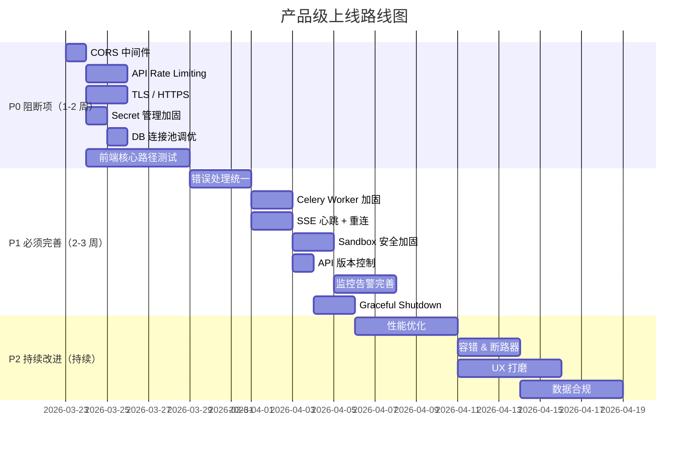

# Research Copilot — 产品级上线差距分析

> 基于 2026-03-22 全量代码审计，覆盖 backend/frontend/deployment/CI/tests 五大维度。

---

## 一、总体评估

| 维度            | 完成度 | 生产就绪度                                        |
| --------------- | ------ | ------------------------------------------------- |
| **后端 API 层** | ★★★★☆  | 80% — 功能完整，缺安全加固                        |
| **Agent 核心**  | ★★★★☆  | 85% — 6 WF 完整，缺 Graceful Degradation          |
| **前端 UI**     | ★★★☆☆  | 70% — 功能基本可用，缺测试和健壮性                |
| **部署运维**    | ★★★☆☆  | 65% — Docker Compose 就绪，缺 K8s/TLS/Secret 管理 |
| **测试覆盖**    | ★★★☆☆  | 60% — 后端测试丰富，前端零测试                    |
| **安全合规**    | ★★☆☆☆  | 40% — 基础鉴权有，缺关键安全层                    |

---

## 二、P0 — 必须修复（上线阻断项）

### 🔴 2.1 CORS 中间件缺失

`main.py` 没有注册 `CORSMiddleware`。浏览器跨域请求会被直接拒绝，前后端分离部署将完全不可用。

```python
# 缺失代码 — 需在 main.py 添加
from fastapi.middleware.cors import CORSMiddleware
app.add_middleware(
    CORSMiddleware,
    allow_origins=settings.allowed_origins,  # 需新增配置项
    allow_credentials=True,
    allow_methods=["*"],
    allow_headers=["*"],
)
```

> [!CAUTION]
> 开发环境目前能跑是因为 Vite proxy 代理了请求。一旦部署为独立前端 + API 进程，立即 broken。

---

### ~~🔴 2.2 API 速率限制（Rate Limiting）完全缺失~~ ✅ 已修复 (`551bad7`)

- `slowapi>=0.1.9` 已接入，Redis 存储 + 内存 fallback（`in_memory_fallback_enabled=True`）
- **Auth 端点（按 IP 限流）**：`register`(5/min)、`login`(10/min)、`forgot-password`(3/min)、`reset-password`(3/min)、`oauth/:provider/authorize`(10/min)
- **Agent 端点（按 user_id 限流）**：`create_run`(10/min)、`stream_run_events`(20/min)
- 限流参数全部通过 `RATE_LIMIT_*` 环境变量可覆盖，`RATE_LIMIT_ENABLED=false` 可完整关闭
- `SlowAPIMiddleware` + `RateLimitExceeded` 异常处理器已注册到 `main.py`
- 11 个单元测试全部通过，回归测试无破坏

---

### 🔴 2.3 HTTPS / TLS 未配置

- `nginx.conf` 只有 HTTP 80 端口
- 无 SSL 证书配置
- 无 HTTP→HTTPS 重定向
- OAuth 回调 URL 使用 `http://localhost:5173`

**建议**：部署方案须包含 TLS 终端（Nginx + Let's Encrypt / Cloud LB）。

---

### 🔴 2.4 Secret 管理硬编码风险

| 文件                      | 问题                                              |
| ------------------------- | ------------------------------------------------- |
| `.env.production.example` | `JWT_SECRET=CHANGE_ME_IN_PRODUCTION` — 无强制校验 |
| `docker-compose.yml`      | PG 密码 `postgres:postgres` 硬编码                |
| `docker-compose.yml`      | MinIO 密码 `minioadmin:minioadmin` 硬编码         |

**建议**：生产环境使用 Vault/AWS Secrets Manager/GCP Secret Manager，启动时校验关键 secret 不为默认值。

---

### ~~🔴 2.5 数据库连接/Session 安全~~ ✅ 已修复 (`c5ed8ad`)

- `pool_size` 提升为 30，`max_overflow` 提升为 20
- 新增 `pool_timeout=30s`（防止连接池耗尽时请求无限挂起）
- 新增 `pool_recycle=1800s`（防止防火墙断开长连接）
- 所有参数通过 `DB_POOL_SIZE` / `DB_MAX_OVERFLOW` / `DB_POOL_TIMEOUT` / `DB_POOL_RECYCLE` 环境变量可覆盖

---

### ~~🔴 2.6 前端零测试~~ ✅ 已修复 (`ddbfcd1` + `6cfcf9e`)

- Vitest + MSW v2 + @testing-library/react 测试基础设施完整搭建
- **76 个用例，10 个文件，全部通过**，覆盖：
  - `useAgentStore` — 全部 10 种 SSE 事件类型的状态机（含边界）
  - `useLayoutStore` — 全部 toggle/setter 方法
  - `api.ts` — token 注入、401 自动刷新、**并发 401 只触发一次 refresh** 的队列机制、403/429/5xx toast
  - `AuthProvider` — 初始化 / login / logout 流程
  - `AuthGuard` / `GuestGuard` — 路由守卫全分支
  - `useSSE` — EventSource 连接、事件分发、run_end 关闭、**3 级指数退避边界验证**（2s→4s→8s）
  - `useDocuments` / `useThreads` / `useWorkspaces` — 全部 Query + Mutation hooks
- 测试文件已从 `tsconfig.app.json` 排除，生产构建不受影响

---

## 三、P1 — 上线前必须完善

### 🟡 3.1 错误处理不完整

| 位置         | 问题                                                                                           |
| ------------ | ---------------------------------------------------------------------------------------------- |
| `main.py:56` | `except (ValueError, ImportError)` 过于宽泛，会静默吞掉 agent 初始化错误                       |
| SSE stream   | `event_generator` 中未处理 DB session 超时/断开的情况                                          |
| Sandbox      | `DockerExecutor.execute` 中 `docker.errors.DockerException` 直接 raise，未封装为用户友好的错误 |
| LLM Gateway  | `LLMUnavailableError` 未被 `app_error_handler` 覆盖（不是 `AppError` 子类）                    |

---

### ~~🟡 3.2 Celery Worker 缺少关键配置~~ ✅ 已修复 (`6d1ca5f`)

- `task_time_limit=1800s`（硬超时）、`task_soft_time_limit=1500s`（软超时）已配置，防止 Worker 永久挂起
- `result_expires=86400s` 防止 Redis 任务结果无限堆积
- `task_reject_on_worker_lost=True` + `task_acks_on_failure_or_timeout=False` 构成死信追踪闭环
- `ingest_document` 迁移为声明式 `autoretry_for`（指数退避，最多 3 次）
- `celery-worker` 补充 `healthcheck`（`celery inspect ping`）
- 所有参数通过 `Settings` 环境变量可覆盖

---

### 🟡 3.3 Agent SSE 流的健壮性

- SSE `event_generator` 中异常会导致流中断但客户端不一定能感知
- 没有心跳机制（keep-alive），长时间无事件时连接可能被代理/LB 断开
- 缺少事件 ID 持久化，断线重连可能丢失事件

---

### 🟡 3.4 Sandbox 安全加固

| 项目            | 当前状态 | 建议                                      |
| --------------- | -------- | ----------------------------------------- |
| 磁盘限制        | 无       | 添加 `storage_opt` 限制或 tmpfs           |
| PID 限制        | 无       | `pids_limit=100` 防止 fork bomb           |
| 只读文件系统    | 否       | `read_only=True` + tmpfs for `/workspace` |
| seccomp profile | 默认     | 使用更严格的 seccomp/AppArmor             |
| Privileged 检查 | 未校验   | 确保 `privileged=False`                   |

---

### 🟡 3.5 缺少 API 版本控制

所有 API 路径为 `/api/xxx`，无版本前缀 `/api/v1/xxx`。上线后变更 API 将导致客户端兼容性问题。

---

### ~~🟡 3.6 日志 & 监控缺口~~ ✅ 已修复 (`085894f`, `f5f18ed`)

| 项目                     | 状态                                                                                      |
| ------------------------ | ----------------------------------------------------------------------------------------- |
| Prometheus metrics       | ✅ 已接入                                                                                  |
| structlog + trace_id     | ✅ 已实现                                                                                  |
| Grafana dashboard        | ✅ `research_copilot.json` 已预配（API/LLM/Celery/Loki 四行面板）                          |
| 日志聚合（Loki）         | ✅ `loki-config.yaml` + `promtail-config.yaml`，docker_sd_configs 自动发现，15d 保留       |
| 告警规则（AlertManager） | ✅ `alerts.yml`（5 条规则）+ `alertmanager.yml`（webhook + Slack/Email 模板）              |
| LLM token 用量监控       | ✅ `llm_tokens_total` / `llm_requests_total` 已在 `quota_service.check_and_consume` 中暴露 |

---


### 🟡 3.7 缺少 Graceful Shutdown

- `LangGraphRunner.shutdown()` 被调用，但活跃的 Agent run 没有被安全终止
- Celery Worker 缺少 `SIGTERM` 优雅退出配置
- SSE 连接在 shutdown 时没有发送关闭事件

---

## 四、P2 — 上线后持续改进

### 🔵 4.1 性能优化

| 项目          | 建议                                                     |
| ------------- | -------------------------------------------------------- |
| RAG Embedding | `sentence-transformers` 加载在单线程中，需换成 GPU async |
| DB N+1        | 部分查询（如 workspace 列表）可能存在 N+1                |
| SSE 连接池    | 大量并发用户时 SSE 长连接会占用 worker 线程              |
| 前端构建      | 无 code splitting/动态导入配置                           |

---

### 🔵 4.2 可用性 & 容错

| 项目           | 建议                                       |
| -------------- | ------------------------------------------ |
| 断路器         | LLM Gateway 无断路器，连续失败会重试到耗尽 |
| 连接池健康检查 | Redis/PG 连接池无主动健康检查              |
| 多区部署       | 无 K8s manifest / Terraform                |
| 蓝绿/灰度部署  | 无                                         |

---

### 🔵 4.3 用户体验打磨

| 项目           | 状态                                      |
| -------------- | ----------------------------------------- |
| 响应式布局     | ⚠️ 有 `useMediaQuery` 但移动端适配未见测试 |
| 离线/弱网提示  | ❌                                         |
| 文件上传进度条 | ⚠️ 前端有 Dropzone 但进度反馈不明确        |
| 国际化         | ✅ 骨架已有（`i18n/`），但翻译覆盖率未知   |
| 无障碍（a11y） | ❌ 未见 ARIA 属性或 a11y 审计              |

---

### 🔵 4.4 数据安全与合规

| 项目             | 状态                                                 |
| ---------------- | ---------------------------------------------------- |
| GDPR 数据删除    | ❌ 无"删除我的数据"功能                               |
| 数据加密 at rest | ❌ S3/MinIO 和 PG 均为明文                            |
| 审计日志         | ❌ 核心操作（删除工作区、运行代码）无审计记录         |
| Cookie 安全属性  | ⚠️ refresh token 用了 HttpOnly 但未见 Secure/SameSite |
| CSP 头           | ❌ 未配置 Content-Security-Policy                     |
| 输入校验         | ⚠️ Pydantic schema 有基础校验，但缺少长度/注入防护    |

---

## 五、按优先级排序的实施路线图


