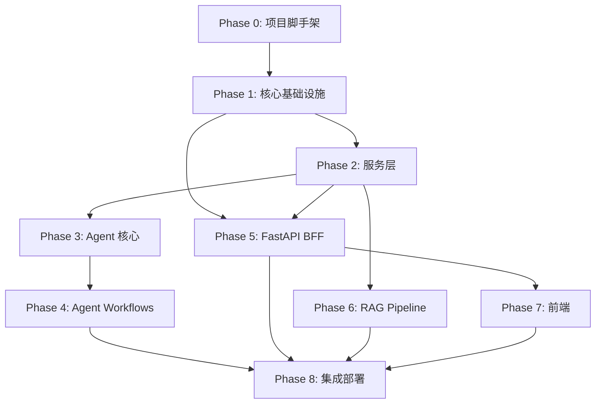

# Research Copilot — 实现规划总览

> **For agentic workers:** REQUIRED SUB-SKILL: Use superpowers:subagent-driven-development (recommended) or superpowers:executing-plans to implement this plan task-by-task. Steps use checkbox (`- [ ]`) syntax for tracking.

**Goal:** 将已完成的 8 个设计 spec 转化为可执行代码，按依赖层级分阶段实现全栈科研自动代理工作站。

**Architecture:** 前后分离的微服务架构。后端分为 FastAPI BFF（业务控制面）+ LangGraph Server（Agent 运行时）+ Celery Worker（异步管道）。前端 React SPA 通过 SSE/REST 与 BFF 通信。PostgreSQL + pgvector 为唯一数据源。

**Tech Stack:** Python 3.11+ / uv / FastAPI / LangGraph / Celery / Docker SDK / React 18 / TypeScript / Vite / Zustand / React Query / TipTap / PostgreSQL 16 + pgvector

---

## 依赖关系图



## 分阶段规划

| Phase | 名称            | 依赖        | 核心产出                                                  | 预估 Tasks | 规划文档                                                                                                               |
| ----- | --------------- | ----------- | --------------------------------------------------------- | ---------- | ---------------------------------------------------------------------------------------------------------------------- |
| **0** | 项目脚手架      | —           | pyproject.toml, 目录骨架, docker-compose 基础, CI lint    | ~8         | [plan-phase-0](file:///home/wenmou/Projects/ResearchCopilot/docs/superpowers/plans/2026-03-19-phase-0-scaffolding.md)  |
| **1** | 核心基础设施    | P0          | config, database, logger, ORM models, Alembic migrations  | ~10        | [plan-phase-1](file:///home/wenmou/Projects/ResearchCopilot/docs/superpowers/plans/2026-03-19-phase-1-core-infra.md)   |
| **2** | 服务层          | P1          | LLM Gateway, Sandbox Manager, Parser Engine, RAG Engine   | ~12        | [plan-phase-2](file:///home/wenmou/Projects/ResearchCopilot/docs/superpowers/plans/2026-03-19-phase-2-services.md)     |
| **3** | Agent 核心      | P2          | SharedState, PromptLoader, SkillRegistry, Supervisor 主图 | ~15        | [plan-phase-3](file:///home/wenmou/Projects/ResearchCopilot/docs/superpowers/plans/2026-03-19-phase-3-agent-core.md)   |
| **4** | Agent Workflows | P3          | 6 个子图 (Discovery→Publish)                              | ~18        | [plan-phase-4](file:///home/wenmou/Projects/ResearchCopilot/docs/superpowers/plans/2026-03-19-phase-4-workflows.md)    |
| **5** | FastAPI BFF     | P1,P2       | API 路由, SSE 翻译, 中间件, 依赖注入                      | ~14        | [plan-phase-5](file:///home/wenmou/Projects/ResearchCopilot/docs/superpowers/plans/2026-03-19-phase-5-bff.md)          |
| **6** | RAG Pipeline    | P2          | Celery Worker, PDF 解析任务, 向量化任务                   | ~10        | [plan-phase-6](file:///home/wenmou/Projects/ResearchCopilot/docs/superpowers/plans/2026-03-19-phase-6-rag-pipeline.md) |
| **7** | 前端            | P5          | React SPA, Chat/Canvas 双栏, SSE 流, HITL 交互            | ~20        | [plan-phase-7](file:///home/wenmou/Projects/ResearchCopilot/docs/superpowers/plans/2026-03-19-phase-7-frontend.md)     |
| **8** | 集成部署        | P4,P5,P6,P7 | docker-compose 全栈, E2E 冒烟测试, 健康检查               | ~8         | [plan-phase-8](file:///home/wenmou/Projects/ResearchCopilot/docs/superpowers/plans/2026-03-19-phase-8-integration.md)  |

## 关键里程碑

| 里程碑                   | 完成条件                                             | 涉及 Phase        |
| ------------------------ | ---------------------------------------------------- | ----------------- |
| **M1：骨架可运行**       | `uv run fastapi dev` 启动成功，`/health` 返回 200    | P0 + P1           |
| **M2：单 Workflow 跑通** | Discovery WF 接收查询 → 返回论文列表（含 mock 数据） | P2 + P3 + 部分 P4 |
| **M3：BFF 全链路**       | 前端发消息 → BFF 转发 → Agent 执行 → SSE 推送结果    | P5                |
| **M4：RAG 入库可查**     | 上传 PDF → MinerU 解析 → 切块入库 → 向量检索返回结果 | P6                |
| **M5：前端可交互**       | Chat 发送/接收 + Canvas 展示 + HITL 确认流程         | P7                |
| **M6：全栈端到端**       | docker-compose up → 完整科研流程跑通                 | P8                |

## 并行开发策略

```
时间线 ──────────────────────────────────────────────►

P0 ████
P1     ████████
P2             ████████████
P3                         ████████████████
P4                                         ██████████████████
P5         ████████████████                               (P1 就绪后可并行)
P6                 ████████████                           (P2 就绪后可并行)
P7                                 ████████████████████   (P5 就绪后)
P8                                                     ████████
```

- **P5 (BFF) 可与 P2/P3 并行**：BFF 对 Agent 的调用先用 mock，Agent 就绪后切换
- **P6 (RAG) 可与 P3/P4 并行**：RAG Worker 独立于 Agent 主流程
- **P7 (前端) 在 P5 完成 API 定义后即可开工**：用 MSW 或 mock server 开发

## 每个 Phase 文档统一格式

每个 Phase plan 文档包含：
1. **Goal** — 该阶段目标
2. **对应设计文档** — 引用相关 spec
3. **文件结构** — 新建/修改的文件清单
4. **任务分解** — 带 checkbox 的细粒度步骤（含代码、命令、预期输出）
5. **验证计划** — 该阶段完成后如何验证

---

## 实施约定

| 约定       | 规则                                 |
| ---------- | ------------------------------------ |
| 包管理     | `uv`，所有依赖写入 `pyproject.toml`  |
| 代码风格   | `ruff` lint + format，严格类型标注   |
| 测试框架   | `pytest` + `pytest-asyncio`          |
| Git 规范   | 原子提交，`type: short description`  |
| 分支策略   | Phase 粒度 feature branch → main     |
| 环境变量   | Pydantic `BaseSettings`，`.env` 文件 |
| 数据库迁移 | Alembic                              |
