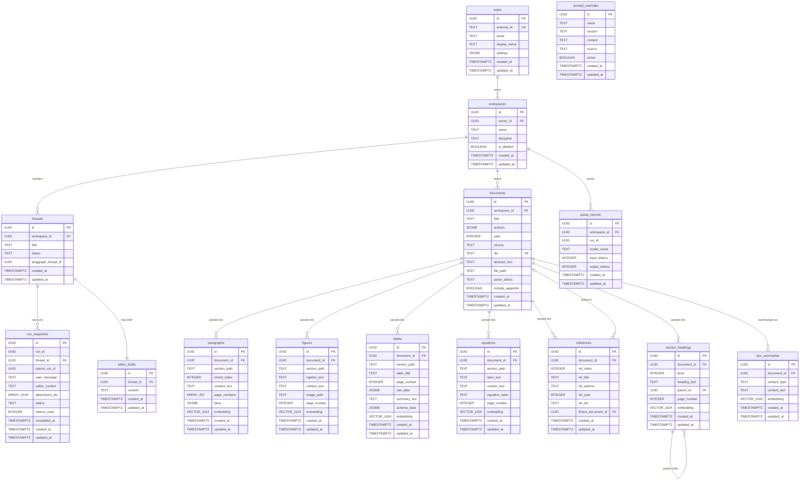

# 数据库 Schema 全景设计

> 现有 15 张表的统一 ER 图、索引策略、命名规范与约束规则。

---

## 一、设计原则

1. **单库单 Schema** — PostgreSQL 16 + pgvector 扩展，不分库分表
2. **UUID 主键** — 全表统一 `gen_random_uuid()`，通过 `UUIDPrimaryKeyMixin`
3. **审计时间** — 全表统一 `created_at` / `updated_at`，通过 `TimestampMixin`
4. **物理删除** — 不做软删除（Workspace 的 `is_deleted` 为历史遗留，后续统一为物理删除）
5. **外键级联** — 解析产物 → `documents` 声明 `ON DELETE CASCADE`

---

## 二、ER 全景图



---

## 三、表分组说明

### 3.1 核心实体（3 张）

| 表           | 职责                | 关键关系               |
| ------------ | ------------------- | ---------------------- |
| `users`      | 用户（同步自 Auth） | 拥有 Workspace         |
| `workspaces` | 课题空间            | 包含 Thread + Document |
| `threads`    | 对话线程            | 对应 LangGraph Thread  |

### 3.2 文档与解析产物（8 张）

| 表                 | 职责                 | 向量列       |
| ------------------ | -------------------- | ------------ |
| `documents`        | 文献元数据           | —            |
| `doc_summaries`    | 文档级摘要           | ✅ 1024 维    |
| `paragraphs`       | 正文段落（RAG 主力） | ✅ 1024 维    |
| `figures`          | 图表                 | ✅ 1024 维    |
| `tables`           | 表格                 | ✅ 1024 维    |
| `equations`        | 数学公式             | ✅ 1024 维    |
| `section_headings` | 章节导航             | ✅ 1024 维    |
| `references`       | 参考文献             | — (不做嵌入) |

### 3.3 Agent 运行时（2 张）

| 表              | 职责                |
| --------------- | ------------------- |
| `run_snapshots` | Run 输入快照 + 状态 |
| `editor_drafts` | 编辑器草稿          |

### 3.4 系统表（2 张）

| 表                 | 职责                  |
| ------------------ | --------------------- |
| `quota_records`    | Token 消耗记录        |
| `prompt_overrides` | Prompt 覆盖层（GEPA） |

---

## 四、索引策略

### 4.1 必须补齐的索引

| 表                 | 索引                                   | 类型    | 用途                      |
| ------------------ | -------------------------------------- | ------- | ------------------------- |
| `documents`        | `(workspace_id, parse_status)`         | B-Tree  | 按 workspace 筛选文档状态 |
| `paragraphs`       | `(document_id, chunk_index)`           | B-Tree  | 按文档顺序检索段落        |
| `paragraphs`       | `embedding` HNSW (`vector_cosine_ops`) | HNSW    | RAG 语义检索              |
| `doc_summaries`    | `(document_id, content_type)`          | B-Tree  | 按文档查摘要              |
| `doc_summaries`    | `embedding` HNSW (`vector_cosine_ops`) | HNSW    | 文档级语义检索            |
| `run_snapshots`    | `(thread_id, created_at DESC)`         | B-Tree  | 按 thread 查历史 run      |
| `run_snapshots`    | `(run_id)` UNIQUE                      | B-Tree  | 按 run_id 查快照          |
| `quota_records`    | `(workspace_id, created_at DESC)`      | B-Tree  | 用量统计                  |
| `prompt_overrides` | `(name) WHERE active = true` UNIQUE    | Partial | 同 name 仅一条 active     |
| `figures`          | `(document_id)`                        | B-Tree  | 按文档查图表              |
| `tables`           | `(document_id)`                        | B-Tree  | 按文档查表格              |
| `equations`        | `(document_id)`                        | B-Tree  | 按文档查公式              |
| `references`       | `(document_id, ref_index)`             | B-Tree  | 按文档顺序查引用          |
| `section_headings` | `(document_id, level)`                 | B-Tree  | 按文档查章节树            |

### 4.2 HNSW 索引参数

```sql
CREATE INDEX idx_paragraphs_embedding ON paragraphs
USING hnsw (embedding vector_cosine_ops)
WITH (m = 16, ef_construction = 64);

CREATE INDEX idx_doc_summaries_embedding ON doc_summaries
USING hnsw (embedding vector_cosine_ops)
WITH (m = 16, ef_construction = 64);
```

> `m=16, ef_construction=64` 为中小数据集（< 100 万向量）的推荐配置。

---

## 五、命名规范

| 类别     | 规则                | 示例                           |
| -------- | ------------------- | ------------------------------ |
| 表名     | `snake_case` 复数   | `paragraphs`, `run_snapshots`  |
| 字段名   | `snake_case`        | `parse_status`, `content_text` |
| 主键     | `id`（UUID）        | —                              |
| 外键字段 | `<关联表单数>_id`   | `document_id`, `workspace_id`  |
| 索引名   | `idx_<表名>_<字段>` | `idx_paragraphs_embedding`     |
| 唯一约束 | `uq_<表名>_<字段>`  | `uq_documents_doi`             |

---

## 六、约束规则

### 6.1 外键级联

| 主表         | 从表                                                                                              | 级联规则            |
| ------------ | ------------------------------------------------------------------------------------------------- | ------------------- |
| `documents`  | `paragraphs`, `figures`, `tables`, `equations`, `references`, `section_headings`, `doc_summaries` | `ON DELETE CASCADE` |
| `workspaces` | `threads`, `documents`                                                                            | `ON DELETE CASCADE` |
| `threads`    | `run_snapshots`, `editor_drafts`                                                                  | `ON DELETE CASCADE` |
| `users`      | `workspaces`                                                                                      | `ON DELETE CASCADE` |

### 6.2 Enum 约束

以下字段使用 `CHECK` 约束限制取值：

| 字段                      | 允许值                                                                                 |
| ------------------------- | -------------------------------------------------------------------------------------- |
| `documents.parse_status`  | `pending`, `downloading`, `parsing`, `classifying`, `embedding`, `completed`, `failed` |
| `documents.source`        | `upload`, `arxiv`, `doi`                                                               |
| `run_snapshots.status`    | `running`, `requires_action`, `completed`, `failed`, `cancelled`                       |
| `threads.status`          | `creating`, `active`, `archived`                                                       |
| `prompt_overrides.source` | `manual`, `gepa`                                                                       |

### 6.3 审计字段统一

所有表通过 `TimestampMixin` 提供：
- `created_at TIMESTAMPTZ NOT NULL DEFAULT now()`
- `updated_at TIMESTAMPTZ NOT NULL DEFAULT now()` + `ON UPDATE` 触发

> **现状验证**：15 张表全部已使用 `UUIDPrimaryKeyMixin` + `TimestampMixin`，无需修改。

---

## 七、pgvector 配置

| 配置项       | 值                                                                                  | 说明                               |
| ------------ | ----------------------------------------------------------------------------------- | ---------------------------------- |
| 扩展版本     | pgvector 0.7+                                                                       | 支持 HNSW 索引                     |
| 向量维度     | 1024                                                                                | 对齐 embedding 模型输出            |
| 距离函数     | cosine                                                                              | `vector_cosine_ops`                |
| 索引类型     | HNSW                                                                                | 支持增量插入，查询性能优于 IVFFlat |
| 有向量列的表 | `paragraphs`, `figures`, `tables`, `equations`, `section_headings`, `doc_summaries` | 6 张表                             |

---

## 八、现状审计结果

| 审计项                       | 结果 | 说明                                      |
| ---------------------------- | ---- | ----------------------------------------- |
| UUIDPrimaryKeyMixin 统一     | ✅    | 15/15 表                                  |
| TimestampMixin 统一          | ✅    | 15/15 表                                  |
| 外键声明                     | ⚠️    | 已声明但缺少 `ondelete="CASCADE"`         |
| 索引覆盖                     | ❌    | 大部分查询索引未显式声明                  |
| Enum CHECK 约束              | ❌    | 字符串字段无 CHECK 约束，依赖应用层校验   |
| prompt_overrides partial idx | ❌    | 缺少 `WHERE active = true` 的唯一部分索引 |

> **Action Items**：上述 ⚠️ 和 ❌ 在实现阶段通过 Alembic 迁移补齐。
